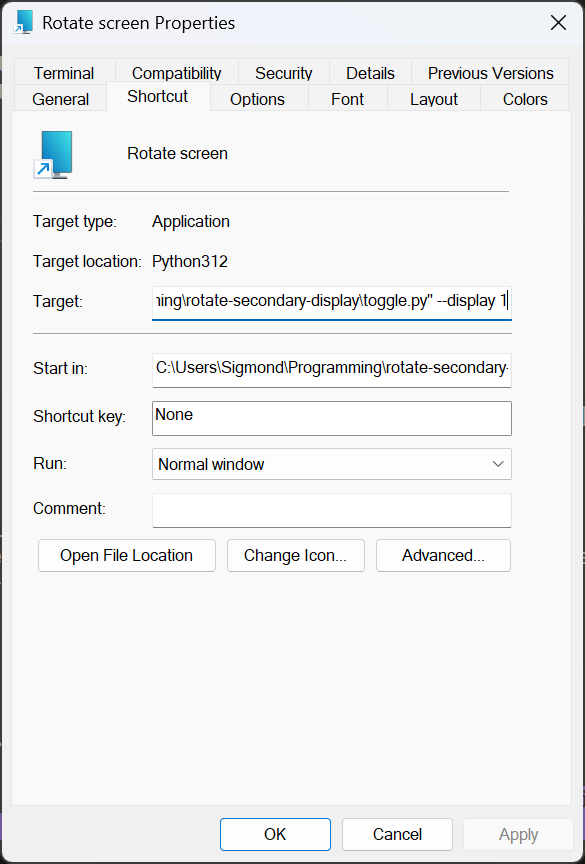

# rotate-secondary-display

This is just a quick-and-dirty tool for rotating my second monitor into portrait mode for programming and writing long documents.
It is current only compatible with Windows.

Noël Danjou's `display` binaries are included in this repository for convenience, however, they can be downloaded [here](http://noeld.com/programs.asp?cat=misc#display) as well.

## Installation

1. Clone or download this repository and save it somewhere safe on your machine.
2. Install a relatively recent version of Python 3. No packages beyond the Python standard library are required.

## Usage

`toggle.py` optionally takes an argument for the display that you would like to rotate (if it is not display 1)
This argument can be passed with `-d` or `--display` and should be an integer, with the minimum value being 1.

1. Test `toggle.py` in the terminal.
2. Optionally edit the script to reflect the rotation angles you need.
3. Create a shortcut to `toggle.py` including appropriate arguments. The shortcut target should look something like this: `PATH\TO\python.exe "PATH\TO\toggle.py" --display 1`
4. Copy the shortcut to your desktop, start menu, or taskbar, and maybe give it an icon!

**Example shortcut:**

